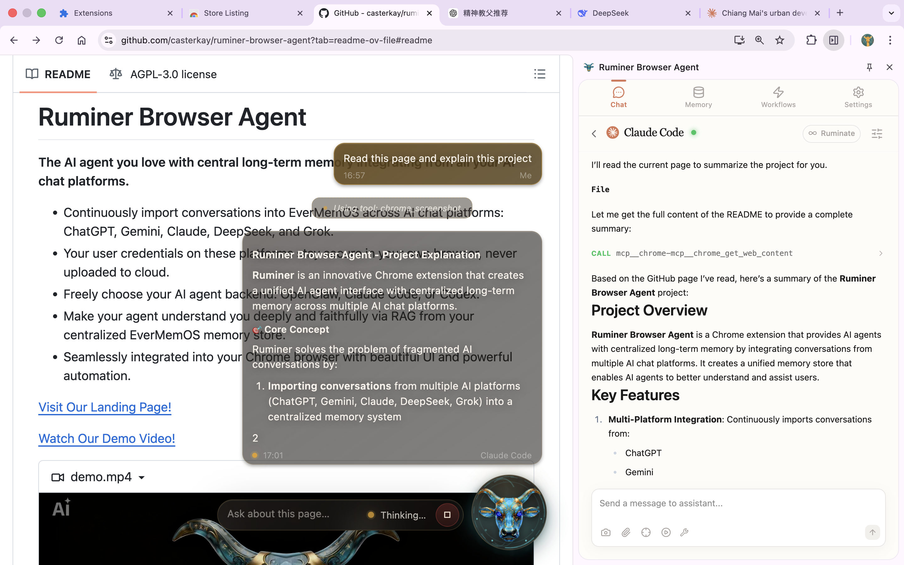
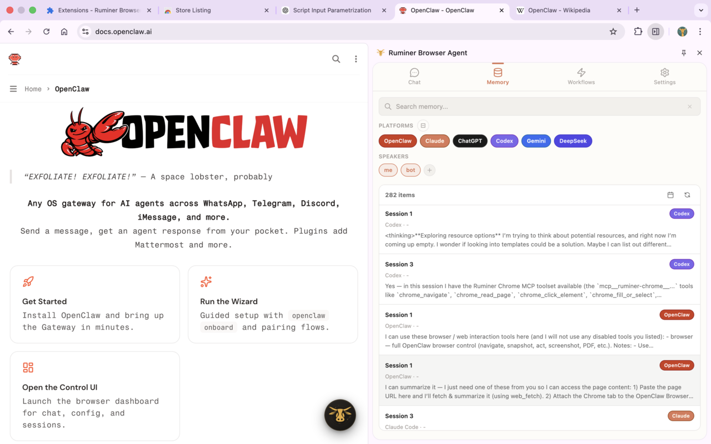
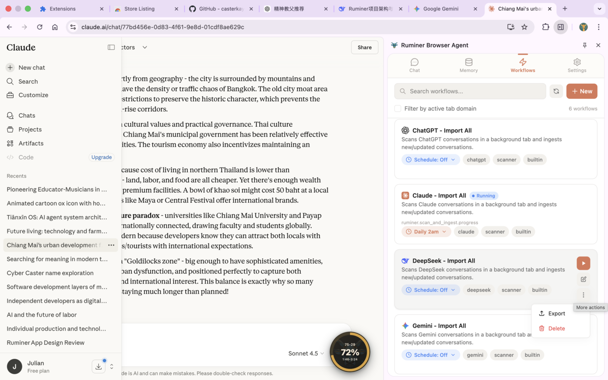
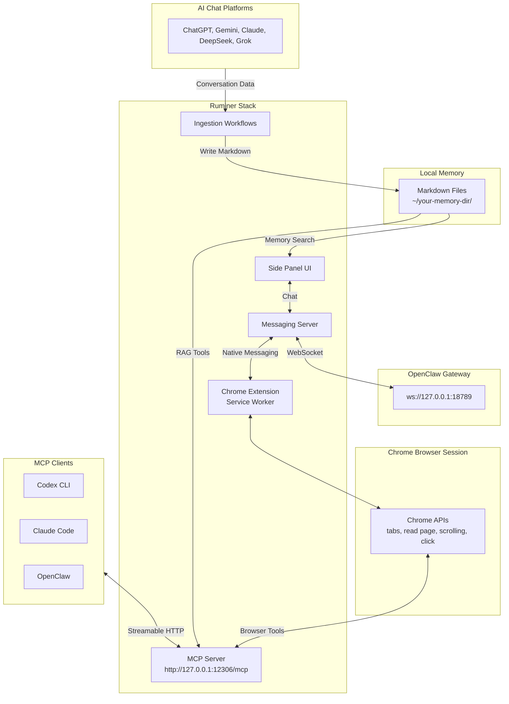

# Ruminer Browser Agent

**Sync your AI conversations from 5+ platforms into your second brain — quick search, agent-ready, yours forever.**

- Continuously export conversations to local Markdown files across AI chat platforms: ChatGPT, Gemini, Claude, DeepSeek, and Grok.
- Your user credentials on these platforms stay secure in your own browser, never uploaded to cloud.
- Freely choose your AI agent backend: OpenClaw, Claude Code, or Codex.
- Make your agent understand you deeply via RAG from your local Markdown conversation archive.
- Seamlessly integrated into your Chrome browser with beautiful UI and powerful automation.

[Visit Our Landing Page!](https://chrome.ruminer.app)

[Watch Our Demo Video!](https://www.youtube.com/watch?v=nvDG8ZCp-O8)

https://github.com/user-attachments/assets/fb49d045-3d43-49b6-b51a-3ee8ff9ed508







## System Architecture



The Ruminer UI has three major pillars in one Chrome extension:

1. **Chat tab**: communicate with your CLI agents via native server, providing MCP tools for browser operations and local RAG.
   - You can toggle tool groups (Memory / Observe / Navigate / Interact / Execute / Workflow) in the message input box to control which ones the agent can use.
2. **Memory tab**: browse/search/manage your local memory directory.
   - Conversations are organized by AI chat platform and stored as plain Markdown files you own.
3. **Workflows tab**: create, edit, and schedule automation workflows to export conversations to your local Markdown directory or accomplish other tasks in browser.
   - Coming soon: agent-driven workflow development by autonomously interacting with the browser and editing the workflow graph!

### Glossary

- **OpenClaw Gateway**: local control plane for chat + tool runtime (Ruminer sidepanel chat talks to it).
- **MCP**: Model Context Protocol; here it’s the standard interface your clients use to call browser tools.
- **Local Markdown memory**: plain `.md` files written to a directory you configure — compatible with Obsidian, Logseq, and any agent that can read files (OpenClaw, Hermes, GBrain, Claude Code, Codex).

## Getting Started (local dev)

### Prerequisites

- Node.js `>= 22.5.0`
- `pnpm` (see `package.json`)
- Chrome/Chromium (MV3 + sidepanel enabled)
- Optional but recommended:
  - `openclaw` CLI (for sidepanel chat + plugin routing)
  - A local Markdown directory path (for memory storage + RAG ingestion)

### 1) Quick setup

From the repo root, run:

```bash
pnpm install
pnpm -C app/chrome-extension build
```

Then open the extension Welcome page (it opens automatically on install) and run the one‑shot installer
to set up Native Messaging + MCP clients:

```bash
curl -fsSL https://raw.githubusercontent.com/casterkay/ruminer-browser-agent/refs/heads/main/scripts/setup.sh | \
  bash -s -- --extension-id <your-extension-id>
```

This installer (best-effort):

- Installs `chrome-mcp-server` and registers the Native Messaging host (allowlisted to your extension ID)
- Adds Ruminer MCP endpoint to Claude Code and Codex (`ruminer-chrome`)
- Installs + enables the OpenClaw plugin (`openclaw-mcp-plugin`) and points it to Ruminer MCP URL

### 2) Load the extension

Chrome does not allow “Load unpacked” via script.

1. Open `chrome://extensions`
2. Enable **Developer mode**
3. Click **Load unpacked**
4. Select:
   - `app/chrome-extension/.output/chrome-mv3`

### 3) Configure the extension

In the `Settings` tab in Ruminer side panel:

- **OpenClaw Gateway**
  - WS URL: `ws://127.0.0.1:18789`
  - Token: your Gateway token
- **Memory Directory**
  - Local path to your Markdown memory folder (e.g. `~/Documents/my-second-brain`)

### Hosted auth and billing URL

Workflow unlock now relies on the hosted Ruminer web app in `landing-page` for Better Auth + Stripe.
The extension opens that app for sign-in, checkout, and account management, then receives a browser-bound
access snapshot back through the background service worker.

- Set `WXT_PUBLIC_RUMINER_WEB_URL` to your hosted web app origin when building or running the extension.
- `VITE_RUMINER_WEB_URL` is also accepted as a fallback alias if you already use that naming in local env files.
- If neither env var is set, the extension defaults to `http://localhost:3000`.

Local dev example:

```bash
cd landing-page
pnpm install
pnpm dev

cd ../app/chrome-extension
WXT_PUBLIC_RUMINER_WEB_URL=http://localhost:3000 pnpm dev
```

## Verify It Works

1. **MCP tool check**:
   - Ask the agent to call a tool (e.g. "List the current tab titles in my browser") in CLI.
2. **Side panel chat**:
   - Open Ruminer side panel → Chat → send a message → see tool calls render inline
3. **Memory suggestions** (requires memory directory configured):
   - Type ≥ 3 characters in message input box → see debounced suggestions from your local Markdown files
4. **Workflows** (requires memory directory configured):
   - Open Workflows tab → run a built‑in workflow → re-run should not duplicate (ledger + stable IDs)

## Developer Notes

This is a pnpm workspace with key packages:

- `app/chrome-extension`: MV3 extension (Vue 3 + WXT + Tailwind)
- `app/native-server`: Fastify server + Native Messaging host + MCP transport
- `packages/shared`: shared types + tool schemas

## License

AGPL-3.0 (see `LICENSE`).
