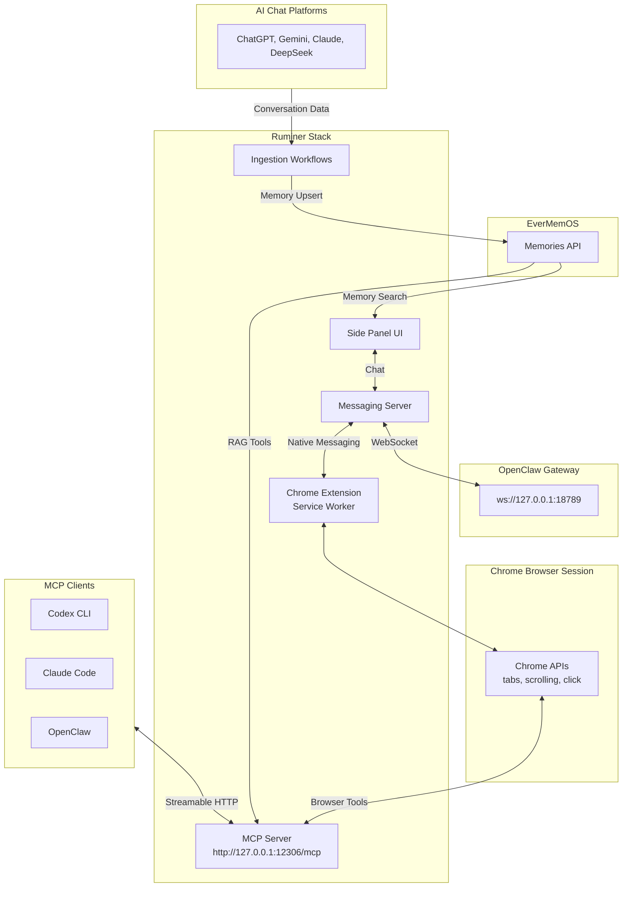

# Ruminer Browser Agent

[Demo video coming soon!] [Landing page coming soon!]

**The AI agent you love with centralized memory integrating from all your AI chat platforms.**

- Continuously import conversations into EverMemOS across AI chat platforms: ChatGPT, Gemini, Claude, and DeepSeek.
- Your user credentials on these platforms stay secure in your own browser, never uploaded to cloud.
- Freely choose your agent engine with browser automation capabilities: OpenClaw, Claude Code, or Codex.
- Make your agent understand you deeply via RAG from your centralized EverMemOS memory store.
- Seamlessly integrated into your Chrome browser with beautiful UI.


## What it is

Ruminer has three user-facing pillars in one Chrome extension:

1. **Chat tab**: a sidepanel chat UI that connects to OpenClaw Gateway (`chat.*`) via the native server.
2. **Memory tab**: browse/search your EverMemOS knowledge base (when configured).
3. **Workflows tab**: run and schedule ingestion workflows to import AI chat histories into EverMemOS.

It also exposes **browser automation tools over MCP** so other clients (Codex CLI, Claude Code, OpenClaw with `mcp-client` plugin) can control your real Chrome session.

## System architecture



### Glossary

- **OpenClaw Gateway**: local control plane for chat + tool runtime (Ruminer sidepanel chat talks to it).
- **MCP**: Model Context Protocol; here it’s the standard interface your clients use to call browser tools.
- **EverMemOS**: long‑term agent memory system where Ruminer can search and ingest messages.

## Getting started (local dev install)

### Prerequisites

- Node.js `>= 22.5.0`
- `pnpm` (see `package.json`)
- Chrome/Chromium (MV3 + sidepanel enabled)
- Optional but recommended:
  - `openclaw` CLI (for sidepanel chat + plugin routing)
  - EverMemOS base URL + API key (for memory + ingestion)

### 1) Quick Setup

From the repo root, run:

```bash
bash scripts/setup.sh
```

What it does (high level):

- Installs workspace deps (pnpm)
- Builds the extension output
- Generates a stable dev extension identity (`app/chrome-extension/.env.local` with `CHROME_EXTENSION_KEY`)
- Registers the Native Messaging host allowlisted to your derived extension ID
- Best‑effort installs/enables OpenClaw plugins + writes config (when `openclaw` CLI is available)

### 2) Load the extension

Chrome does not allow “Load unpacked” via script.

1. Open `chrome://extensions`
2. Enable **Developer mode**
3. Click **Load unpacked**
4. Select:
   - `app/chrome-extension/.output/chrome-mv3`

### 3) Configure the extension

In the Settings tab in Ruminer side panel:

- **OpenClaw Gateway**
  - WS URL: `ws://127.0.0.1:18789`
  - Token: your Gateway token
- **EverMemOS**
  - Base URL + API key (+ tenant/space if your EverMemOS deployment requires it)

## Verify it works (smoke checks)

1. **MCP tool check**:
   - Ask the agent to call a tool (e.g. "List the current tab titles in my browser") in CLI.
2. **Side panel chat**:
   - Open Ruminer side panel → Chat → send a message → see tool calls render inline
3. **Memory suggestions** (requires EverMemOS configured):
   - Type ≥ 3 characters in message input box → see debounced suggestions appear quickly
4. **Workflows** (requires EverMemOS configured):
   - Open Workflows tab → run a built‑in workflow → re-run should not duplicate (ledger + stable IDs)

## Browser tools permissions

Ruminer divides browser tools into 5 groups: **Observe / Navigate / Interact / Execute / Workflow**.
You can toggle groups (and also individual tools) in the message input box to control what tools the agent can use.

## Developer notes (repo shape)

This is a pnpm workspace with key packages:

- `app/chrome-extension`: MV3 extension (Vue 3 + WXT + Tailwind)
- `app/native-server`: Fastify server + Native Messaging host + MCP transport
- `packages/shared`: shared types + tool schemas

Typical dev loop:

```bash
pnpm install
pnpm run dev
```

## License

AGPL-3.0 (see `LICENSE`).
