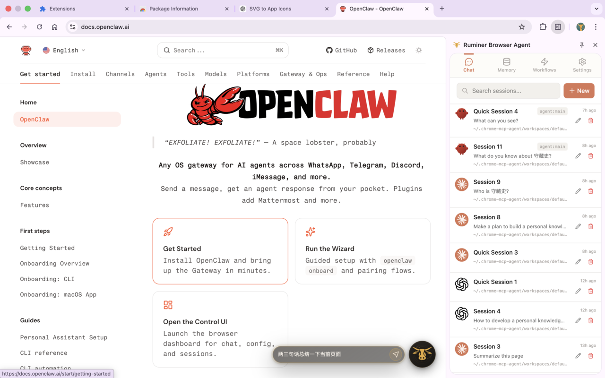

# Ruminer Browser Agent

**The AI agent you love with centralized memory integrating from all your AI chat platforms.**

- Continuously import conversations into EverMemOS across AI chat platforms: ChatGPT, Gemini, Claude, and DeepSeek.
- Your user credentials on these platforms stay secure in your own browser, never uploaded to cloud.
- Freely choose your agent engine with browser automation capabilities: OpenClaw, Claude Code, or Codex.
- Make your agent understand you deeply via RAG from your centralized EverMemOS memory store.
- Seamlessly integrated into your Chrome browser with beautiful UI.




## Quick links

- Quickstart (dev + smoke): `specs/001-ruminer-browser-agent/quickstart.md`
- MCP client setup (Codex CLI / Claude Code): `docs/mcp-cli-config.md`
- Blueprint (architecture + product intent): `.specify/memory/blueprint.md`
- Feature spec (requirements + scenarios): `specs/001-ruminer-browser-agent/spec.md`

## What it is (today)

Ruminer has three user-facing pillars in one Chrome extension:

1. **Chat tab**: a sidepanel chat UI that connects to OpenClaw Gateway (`chat.*`) via the native server.
2. **Memory tab**: browse/search your EverMemOS knowledge base (when configured).
3. **Workflows tab**: run and schedule ingestion workflows (RR‑V3) to import AI chat histories into EverMemOS.

It also exposes **browser automation tools over MCP** so other clients (Codex CLI, Claude Code, OpenClaw via `mcp-client`) can control your real Chrome session.

## How it works (mental model)

```text
MCP clients (Codex / Claude Code / OpenClaw mcp-client)
            |
            | Streamable HTTP MCP
            v
Ruminer Native Server (http://127.0.0.1:12306/mcp)
            |
            | Native Messaging
            v
Chrome Extension (MV3 background SW) -> Chrome APIs (tabs, scripting, debugger, ...)

Sidepanel Chat UI -> Native Server -> OpenClaw Gateway (ws://127.0.0.1:18789)
Workflows (RR‑V3) ---------------> EverMemOS API (direct, from extension)
```

### Glossary

- **OpenClaw Gateway**: local control plane for chat + tool runtime (Ruminer sidepanel chat talks to it).
- **MCP**: Model Context Protocol; here it’s the standard interface your clients use to call browser tools.
- **EverMemOS (EMOS)**: long‑term memory system where Ruminer can search and ingest conversations.
- **RR‑V3**: Ruminer’s workflow runtime (queue + leasing) built for MV3 reliability.

## Getting started (local dev install)

### Prerequisites

- Node.js `>= 22.5.0`
- `pnpm` (see `package.json`)
- Chrome/Chromium (MV3 + sidepanel enabled)
- Optional but recommended:
  - `openclaw` CLI (for sidepanel chat + plugin routing)
  - EverMemOS base URL + API key (for memory + ingestion)

### 1) One‑shot setup (recommended)

From the repo root:

```bash
bash scripts/setup.sh
```

What it does (high level):

- Installs workspace deps (pnpm)
- Builds the extension output
- Generates a stable dev extension identity (`app/chrome-extension/.env.local` with `CHROME_EXTENSION_KEY`)
- Registers the Native Messaging host allowlisted to your derived extension ID
- Best‑effort installs/enables OpenClaw plugins + writes config (when `openclaw` CLI is available)

### 2) Load the extension (manual)

Chrome does not allow “Load unpacked” via script.

1. Open `chrome://extensions`
2. Enable **Developer mode**
3. Click **Load unpacked**
4. Select:
   - `app/chrome-extension/.output/chrome-mv3`

### 3) Start OpenClaw Gateway (for sidepanel chat)

Run locally (the extension expects port `18789` by default):

```bash
openclaw gateway run --port 18789 --force
```

If you use a custom OpenClaw profile, pass `--profile <name>` consistently to both `openclaw gateway ...`
and any `openclaw config ...` commands.

### 4) Configure the extension (Options / Settings)

In Ruminer Settings:

- **OpenClaw Gateway**
  - WS URL: `ws://127.0.0.1:18789`
  - Token: your Gateway token (if your Gateway requires one)
- **EverMemOS**
  - Base URL + API key (+ tenant/space if your EMOS deployment requires it)

Expected behavior when components are missing:

- Without **EverMemOS**: sidepanel chat still works, but no live memory suggestions; workflows that ingest are disabled.
- Without **OpenClaw**: the UI still renders, workflows can still ingest via direct EMOS client, but chat is unavailable.

### 5) Configure MCP clients (automation tools)

See `docs/mcp-cli-config.md` for details.

- Codex CLI:
  - `codex mcp add ruminer-chrome --url http://127.0.0.1:12306/mcp`
- Claude Code:
  - `claude mcp add --transport http ruminer-chrome http://127.0.0.1:12306/mcp`

OpenClaw uses the `mcp-client` plugin to route tool calls to Ruminer’s MCP endpoint. The setup script
attempts to configure this automatically when `openclaw` is installed.

## Verify it works (smoke checks)

1. **MCP tool check** (from Codex CLI / Claude Code):
   - Call `get_windows_and_tabs`
2. **Sidepanel chat** (requires OpenClaw Gateway):
   - Open sidepanel → Chat → send a message → see tool calls render inline
3. **Memory suggestions** (requires EMOS configured):
   - Type ≥ 3 characters → see debounced suggestions appear quickly
4. **Workflows** (requires EMOS configured):
   - Open Workflows tab → run a built‑in workflow → re-run should not duplicate (ledger + stable IDs)

## Safety & permissions (tool groups)

Ruminer groups browser tools by side‑effect level: **Observe / Navigate / Interact / Execute / Workflow**.
You can toggle groups (and sometimes individual tools) in the sidepanel to control what the agent can do.

Disabled tools are enforced in two places:

- **Prompt-layer**: the chat request includes a restriction prompt listing disabled tools.
- **Runtime-layer**: attempts to call a disabled tool are rejected with a clear error.

## Workflows (RR‑V3) & ingestion

- Ruminer’s ingestion workflows are designed to be **idempotent**: reruns should not create duplicates.
- Scheduling is **best-effort while the browser is running** (MV3 cannot reliably wake a fully closed Chrome).
- MVP scope is **AI chat platforms only** (ChatGPT first, then Gemini / Claude / DeepSeek).

## FAQ

**Do I need OpenClaw?**
Yes for sidepanel chat. Workflows can ingest via direct EMOS client without OpenClaw.

**Do I need EverMemOS?**
For memory search and ingestion workflows, yes. Chat can still work without it.

**Why a Chrome extension instead of Playwright?**
Ruminer automates your real, already‑logged‑in browser with your existing profile and state.

**Is anything exposed to the network?**
Ruminer’s endpoints are intended to be localhost-only by default.

## Developer notes (repo shape)

This is a pnpm workspace with key packages:

- `app/chrome-extension`: MV3 extension (Vue 3 + WXT + Tailwind)
- `app/native-server`: Fastify server + Native Messaging host + MCP transport
- `packages/shared`: shared types + tool schemas

Typical dev loop:

```bash
pnpm install
pnpm run dev
```

## Legacy docs notice

This codebase is derived from a mature upstream (`mcp-chrome`). Some legacy files may be incomplete or
out-of-date for Ruminer’s current architecture/product (for example: `README_zh.md`, `docs/ARCHITECTURE.md`,
`docs/TOOLS.md`). When in doubt, treat:

- `README.md` + `specs/001-ruminer-browser-agent/*` + `.specify/memory/blueprint.md`

as the canonical sources of truth.

## License

AGPL-3.0 (see `LICENSE`).
